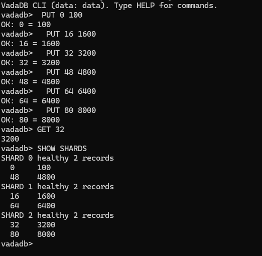
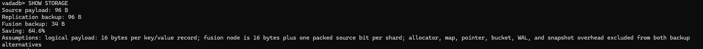
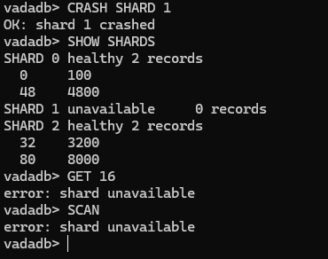
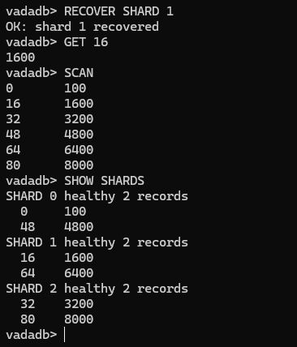
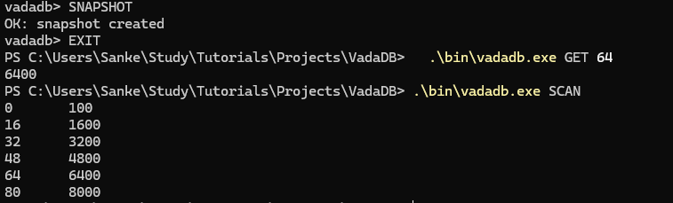

# VadaDB

VadaDB is small implementation of Fusible Data Structures. The original idea is taken from a paper - [Fusible Data Structures for Fault-Tolerance](https://users.ece.utexas.edu/~garg/dist/dcs07.pdf) by Vijay K. Garg and Vinit A. Ogale.

VadaDB uses fused hash table as its fault-tolerance backup. It is Key-Value Database which uses 'uint64'. Three source shards mainain one-XOR fused backup which can reconstruct any failed source with less logical backup payload instead of full replica for sufficiently populated workloads

this implementation contains per-shard and fusion WALs, restart recovery, snapshots, destructive failure simulation, fusion-only source recovery, and CLI

## Why Fusion Recovery is Better than Full Replication

Fusion recovery uses less memory because one XOR-fused structure protects all source shards, instead of storing complete backup of every shard

## What is the catch here

Fusion Recovery requires computation because to recover a shard , it reads the fused backup and combine it with data from every healthy shard using XOR. This reuqires more computation than simply copying a replica. if another source shard is also unavailable because current implementation supports one simulaneous shard failure

## How to Run VadaDB 

```powershell
go build -o .\bin\vadadb.exe .\cmd\vadadb
.\bin\vadadb.exe
```

Commands which are supported by current implementation

```text
PUT <Key> <Value> ;
GET <Key>;
DELETE <Key>;
SCAN;
CRASH SHARD <Number>;
RECOVER SHARD <Number>;
SNAPSHOT;
SHOW SHARDS;
SHOW STORAGE;
HELP;
EXIT;
```

`CRASH` and `RECOVER` must be run in one interactive session because shard failure is an in-memory simulation

## DEMO

### CRUD and Deterministic Sharding



### Fusion storage


### Shard failure


### Fusion recovery


### Snapshot and restart durability


